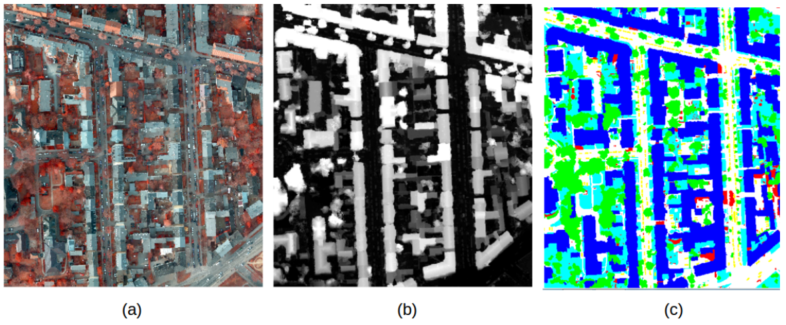
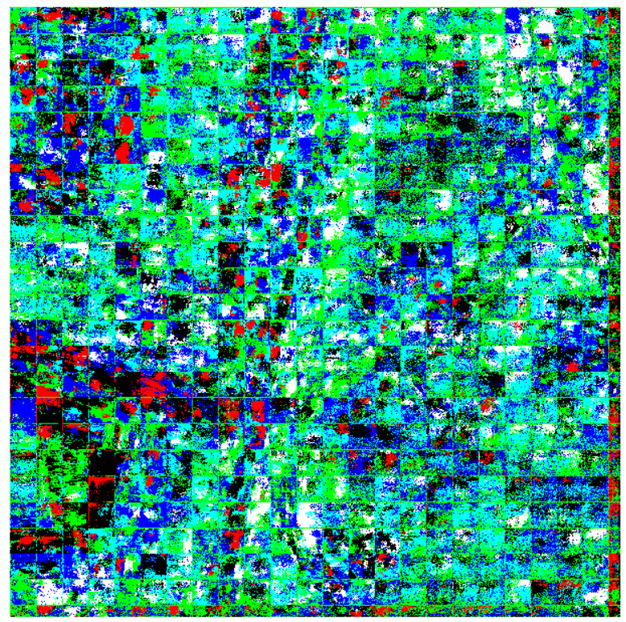
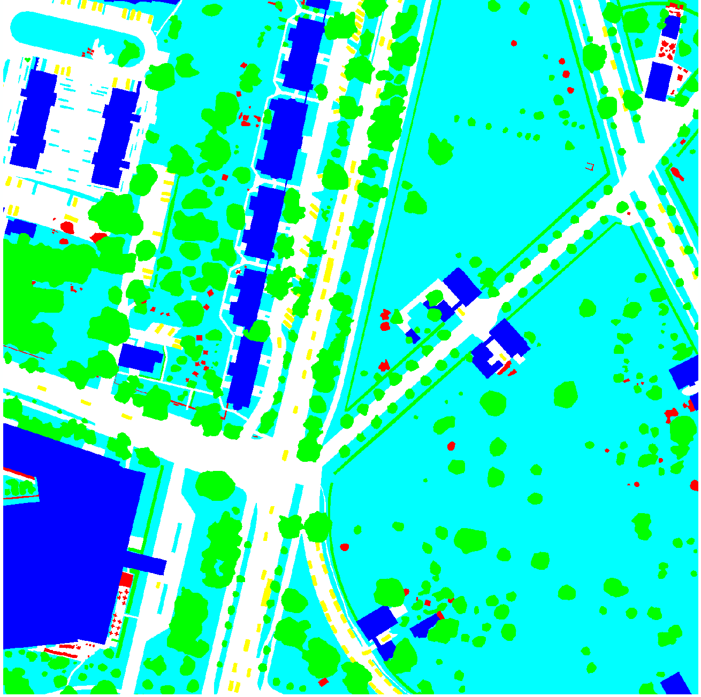
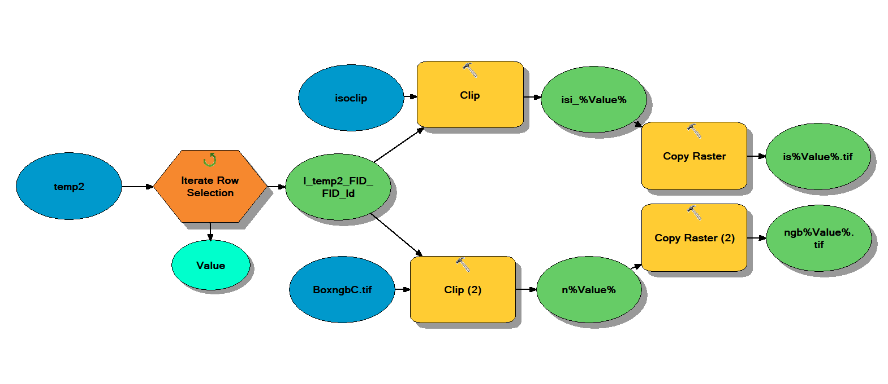

## The Goals of the Project 
# 1. What is the overall aim of the project and what specific Earth Observation is it trying to solve?
  Rastervision is an open source framework that uses python to build computer vision models on satelite imagery.  Our group wanted to use drone imagery and high resolution satelite imagery to segment fairy fungus rings in cranberry bogs and urban tree canopy cover respectively. We used an AWS instance to create a linux environment with rastervision and docker installed. Our group had the following goals: run rastervision quickstart, run rastervision example(s), run rastervision on personal data. Our group was only able to complete the first 2 objectives however we hope to provide information on how to prepare data to run your own semantic segmentation based on personal data.
  Expertise barriers, model choice, and calibration are all limitations in earth observation identified by (the previous class?). Rastervision attempts to act as a potential solution to these limitations by streamlining the model choice, making deep learning algorithms and computer vision accessable to non computer scientists (like geographers). The two models that rastervision uses to run its different examples are Mobilenet (semantic segmentation) and Resnet50 (chip classification).  These models use deep neural networks to train computers to recognize pixels in the case of Mobilenet and objects in the case of Resnet50. Rastervision allows these complex computer vision models to be used by inexperienced users to perform semantic segmentation and chip classification on large datasets. However, this is not necessarily a perfect solution to the limitations of earth observation as users do not a strong grasp of how the models run which will influence the outputs. The push pull between making models like Mobilenet acceccessable and understanding the algorithm is always going to be balance. Rastervisions is another useful stepping stone in advancing the earth observation.    
  
# Methods/Workflow
2. What were the methods you developed and/or applied?
With the help of Professor Estes and Lewis Fishgold, we were able to run rastervision in a GPU p3.2xlarge ubuntu linux instance on Amazon Web Services (AWS). The instance was created from an image with Docker and NVidia installed. Cygwin was used to access the instance. SSH compatability and python were two tool options necessary to download within cygwin. Once this was installed we needed to install the AWS command line tools using: 
'''bash
pip install awscli
'''
The next step was to produce Public SSH keys so multiple users could access the AWS instance. Within cygwin, we followed the first two steps described in [Digital Ocean](https://www.digitalocean.com/community/tutorials/how-to-set-up-ssh-keys--2) and then to set security for our permissions followed up with:
'''bash
chmod 400 ~/.ssh/id_rsa
'''

We had success running the ISPRS Potsdam Semantic Segmentation example from [rastervision examples github](https://github.com/azavea/raster-vision-examples). The input data is below.
<br><br>



Figure 1. Borrowed from the [ISPRS 2D Semantic Labeling Contest - Potsdam webpage](http://www2.isprs.org/commissions/comm3/wg4/2d-sem-label-potsdam.html).

This example uses three different data layers in order to run the predictions. The data is 5cm aerial imagery which uses RBGIR bands to create a true color composite. The second layer is a normalized DSM using lidar imagery.  Finally, ground truth labels are created by hand for 6 classes: building, tree, low vegetation, impervious, car, and clutter. The format of six classes was ideal as the files utlized 3 bands, each with a binary value, for a total of 6 possible combinations. The RGBIR and label files were available as TIFFs. The lidar data was only used for distinguishing the classes and was not necessary beyond identifying the training data. Therefore, for future imitations lidar data is unneccesary if other means of classifying training data is used. All of the training data was downloaded through the request form indicated in the raster vision examples github, and uploaded to an Amazon S3. 

After the initial set up, and our Public SSH keys were added by the instance administrator, Professor Estes, we were able to log into the instance in cygwin via:
```bash
<AWS USER NAME> ubuntu@<INSTANCE IP #>
```
Once there, our successful workflow was:
```bash
docker system prune -a
cd raster-vision-examples
vim scripts/console
```
Then to ensure the GPU is referenced, edit line 42 to:
```bash
IMAGE=raster-vision-examples-gpu
```
Additionally, edit line 34 to resemble:
```bash
docker run --runtime=nvidia ${NAME} --rm -it ${TENSORBOARD} ${AWS} ${RV_CONFIG}
```
Once those adjustments are done, use "q" to exit to get back to the root. Then we can proceed to set up and run the script. 
```bash
cd raster-vision-examples 
scripts/build --gpu
scripts/console
rastervision run local -e potsdam.semantic_segmentation -a root_uri <Path to S3 data ouput location> -a data_uri <Path to S3 Data Folder>
```


# Results
3. What were your results? TERRSET CROSS TABULAR TEST? <br><br>
Several attempts were made to run the rastervision code for the ISPRS Potsdam semantic segmentation dataset. Though our Amazon instance has GPU available, we discovered that the code referenced a CPU workflow. After 18 hours of running, the test completed only 2% of the task (Figure 2). Once we [adjusted for accessing the GPU](https://github.com/agroimpacts/geog287387/blob/master/materials/tutorials/ubuntu-deeplearning-ami-raster-vision.md#install-raster-vision-examples) we were evenutally able to run the code completely. A JSON file is created that indicates the success of predicting each class. Precision and a F-measure are calculated for this purpose. The F-measure is a metric to evaluate classification results that incorporates the harmonic mean of perciesion and recall metrics (Feranadez-Moral et al., 2017). 

Figure 2. Predicted image after 2% completion.


Figure 3. Original RGBIR image.

 
Figure 4. Training labels data.
<div style="width:45%"></div>
Figure 5. Output image of completed rastervision prediction.


<br><br>


4. Did the results show that the project aim was realized? Was an Earth Observation limit pushed back (or potentially pushed back)? If this was a group project, how were the results of individual efforts integrated? 
5. What are potential improvements, and any next steps you plan to take? 
Our recommendations would be to have the primary owner of the Amazon virtual machine service account launch all instances, as we found that adding permissions for other IPs to launch instances frusrating as the remote conection would close or reset prematurely without warning. Beyond this example, we persistently ran into permission issues throughout orientating our workflow for rastervision, so steps taken early to remove user limitations is ideal. This is also alleviated some through the use of cygwin, as we were unsuccessful on completing rastervision examples on platforms such as RStudio and Powershell within AWS instances. During the initial installation of cygwin, there are options for which features to download. Here is where we recommend users to add the SSH key as well as python, as downloading python in cygwin post-installation was a challenge. For the AWS instance, utilizing a GPU and ensuring the GPU is referenced when running the code is necessary as the CPU was not capable of completing the rastervision iterations. There were many times we were stuck, with the most useful resources for pulling through being [Dr. Lynden Estes supporting documentation](file:///C:/Users/CGaffey/Documents/DroneClass/RasterVisionBick/docs/ubuntu-deeplearning-raster-vision-ami.html) the links through the [raster vision examples github] and advice from Lewis Fishgold (aka Lewfish) on the Github social media platform, [GITTER](https://gitter.im/azavea/raster-vision).

# Next Steps
The goal is to mimick the ISPRS Potsdam training data format to substitute our own data to use with rastervision. An orthomosaic was created in PixD from multispectral data collected in NIR, Green, and Blue flown by an unmanned aerial vehicle in 2015 over a cranberry bog. The cranberry bog is under treatment for an infestation of fairy ring fungus that is visible from the aerial images. Traditional classification methods have not been sensitive enough to distinguish between healthy, effected, and recovering vegetation within the bog and the hope is rastervision will provide more realistic results than the training data can provide. Unlike the Potsdam training data, in order to create a labels TIFF, a specific test field was chosen and an Iso Cluster Unsupervised Classification was run for 6 classes (Figure 6). Though our interest does not necessarily require 6 classes, this is following the lead of what was available within the Potsdam dataset and would also allow opportunity for sparsing of traits such as bare soil, multiple levels of recovering vegetation, and shadows due to clouds which are visible in the orthomosaic. To create individual images, a fishnet was laid on the test field (Figure 7).


Figure 6. The sample field iso cluster classification overlayed on the NGB orthomosaic. 

Figure 7. The NGB orthomosaic test field with the fishnet grid to form individual images.

The next step was to create corresponding NGB and label image files. This was done using the ArcMap Model Builder to iterate through each row to clip and save as a TIFF. 

Figure 8. The model used to take convert the fishnet grid to individual TIFFs.

Steps to follow would be to upload this dataset to the AWS S3 and adjust the code to reference this. Once the data and root folders are created, an instance can be launched and the previous workflow used to predict the vegetation classes. Once this completes, the data will be analyzed in hope that the predicted data is more informative to the stages of fairy ring fungus on the cranberry bog than the training data. 
### References

Eduardo Fernandez-Moral, Renato Martins, Denis Wolf, Patrick Rives. A new metric for evaluating semantic segmentation: leveraging global and contour accuracy. Workshop on Planning, Perception and Navigation for Intelligent Vehicles, PPNIV17, Sep 2017, Vancouver, Canada.

Kaiming He, Xiangyu Zhang, Shaoqing Ren, & Jian Sun. “Deep Residual Learning for Image Recognition”. arXiv 2015.

G. Howard, Andrew & Zhu, Menglong & Chen, Bo & Kalenichenko, Dmitry & Wang, Weijun & Weyand, Tobias & Andreetto, Marco & Adam, Hartwig. (2017). MobileNets: Efficient Convolutional Neural Networks for Mobile Vision Applications.

