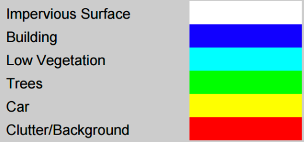
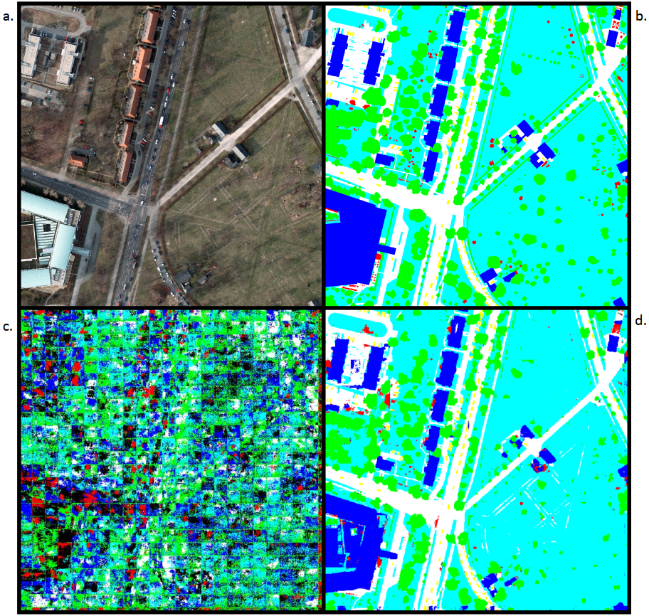
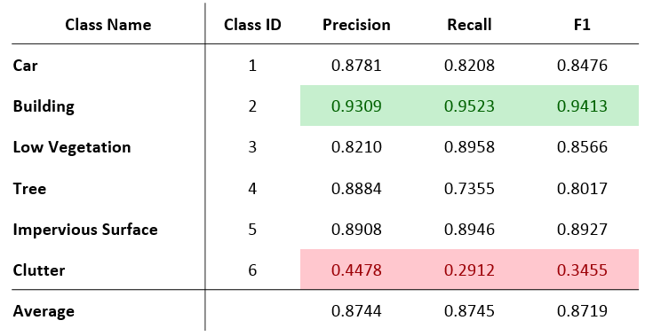
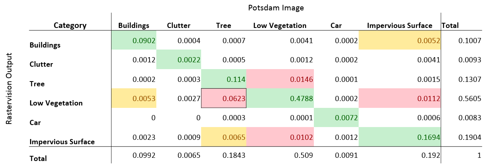
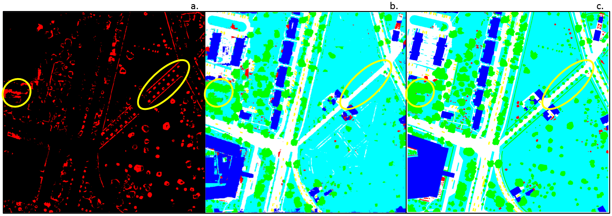
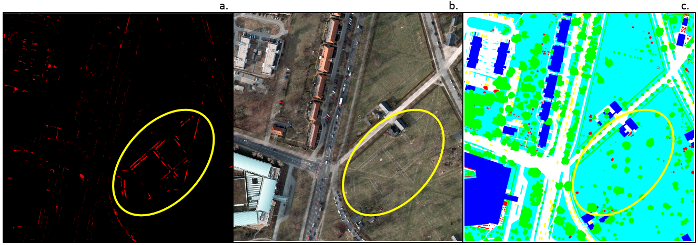
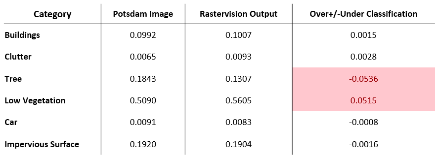

## Goals and Aims of the Project 

  Rastervision is an open source framework that uses python to build computer vision models on satelite imagery.  Our group wanted to use drone imagery and high resolution satelite imagery to segment fairy fungus rings in cranberry bogs and urban tree canopy cover respectively. We used an AWS instance to create a linux environment with rastervision and docker installed. Our group had the following goals: run rastervision quickstart, run rastervision example(s), run rastervision on personal data. Our group was only able to complete the first 2 objectives however we hope to provide information on how to prepare data to run your own semantic segmentation based on personal data.
  Expertise barriers, model choice, and calibration are all limitations in earth observation identified by (the previous class?). Rastervision attempts to act as a potential solution to these limitations by streamlining the model choice, making deep learning algorithms and computer vision accessable to non computer scientists (like geographers). The two models that rastervision uses to run its different examples are Mobilenet (semantic segmentation) and Resnet50 (chip classification).  These models use deep neural networks to train computers to recognize pixels in the case of Mobilenet and objects in the case of Resnet50. Rastervision allows these complex computer vision models to be used by inexperienced users to perform semantic segmentation and chip classification on large datasets. However, this is not necessarily a perfect solution to the limitations of earth observation as users do not a strong grasp of how the models run which will influence the outputs. The push pull between making models like Mobilenet acceccessable and understanding the algorithm is always going to be balance. Rastervisions is another useful stepping stone in advancing the earth observation.    
  
# Methods/Workflow

With the help of Dr. Lyndon Estes and Lewis Fishgold, we were able to run rastervision in a GPU p3.2xlarge ubuntu linux instance on Amazon Web Services (AWS). The instance was created from an image with Docker and NVidia installed. Cygwin was used to access the instance. SSH compatability and python were two tool options necessary to download within cygwin. Once this was installed we needed to install the AWS command line tools using: 
```bash
pip install awscli
```
The next step was to produce Public SSH keys so multiple users could access the AWS instance. Within cygwin, we followed the first two steps described in [Digital Ocean](https://www.digitalocean.com/community/tutorials/how-to-set-up-ssh-keys--2) and then to set security for our permissions followed up with:
```bash
chmod 400 ~/.ssh/id_rsa
```

We had success running the ISPRS Potsdam Semantic Segmentation example from [rastervision examples github](https://github.com/azavea/raster-vision-examples). The input data is below.
<br><br>


Figure 1. Borrowed from the [ISPRS 2D Semantic Labeling Contest - Potsdam webpage](http://www2.isprs.org/commissions/comm3/wg4/2d-sem-label-potsdam.html).

This example uses three different data layers in order to run the predictions. The data is 5cm aerial imagery which uses RBGIR bands to create a true color composite. The second layer is a normalized DSM using lidar imagery.  Finally, ground truth labels are created by hand for 6 classes: building, tree, low vegetation, impervious, car, and clutter. The format of six classes was ideal as the files utlized 3 bands, each with a binary value, for a total of 6 possible combinations. The RGBIR and label files were available as TIFFs. The lidar data was only used for distinguishing the classes and was not necessary beyond identifying the training data. Therefore, for future imitations lidar data is unneccesary if other means of classifying training data is used. All of the training data was downloaded through the request form indicated in the raster vision examples github, and uploaded to an Amazon S3. 

After the initial set up, and our Public SSH keys were added by the instance administrator, Lyndon Estes, we were able to log into the instance in cygwin via:
```bash
<AWS USER NAME> ubuntu@<INSTANCE IP ADDRESS>
```
Once there, our successful workflow was:
```bash
docker system prune -a
cd raster-vision-examples
vim scripts/console
```
Then to ensure the GPU is referenced, edit line 42 to:
```bash
IMAGE=raster-vision-examples-gpu
```
Additionally, edit line 34 to resemble:
```bash
docker run --runtime=nvidia ${NAME} --rm -it ${TENSORBOARD} ${AWS} ${RV_CONFIG}
```
Once those adjustments are done, use "q" to exit to get back to the root. Then we can proceed to set up and run the script. 
```bash
cd raster-vision-examples 
scripts/build --gpu
scripts/console
rastervision run local -e potsdam.semantic_segmentation -a root_uri <Path to S3 data ouput location> -a data_uri <Path to S3 Data Folder>
```


# Results
<br><br>
Several attempts were made to run the rastervision code for the ISPRS Potsdam semantic segmentation dataset. Though our Amazon instance has GPU available, we discovered that the code referenced a CPU workflow. After 18 hours of running, the test completed only 2% of the task (Figure 2). Once we [adjusted for accessing the GPU](https://github.com/agroimpacts/geog287387/blob/master/materials/tutorials/ubuntu-deeplearning-ami-raster-vision.md#install-raster-vision-examples) we were evenutally able to run the code completely. Figure 2a and 2b show the RGB and classified tutorial data provided by ISPRS, while 2c shows the rastervision processing result after only 2% completion. Figure 2d shows the completed rastervision predicted image.



Figure 2. Tutorial Data and Outputs.

A JSON file is created along with the output that indicates the success of predicting each class within the image. Precision and a F-measure are calculated for this purpose. The F-measure is a metric to evaluate classification results that incorporates the harmonic mean of precision and recall metrics (Feranadez-Moral et al., 2017). It combines the precsion metric ((True Positives)/(True Positives+False Positives)) and the recall metric ((True Positives)/(True Positives+False Negatives)) to explain the performance of the model (F1=2*1/(1/precision + 1/recall)). 



Table 1. Class Prediction Evaluation table for rastervision output


Table 1 shows in green that the Building class has the highest F1 statistic. This may be because the spectral signatures across the RGBIR Potsdam image lead to easier classification for the Building class. This class has high Precision and high Recall leading to more accurate classification. Table 1 also shows in the red the lowest F1 statistic – Clutter which has low Precision and even lower Recall which shows it misclassified many instances because they were difficult to classify. This class is made up of various surface objects that do not make up any of the other classes and therefore is very hard to discern what exactly is to be included within it. The overall average of the F1 statistic places this output at 87.19%. 
To further investigate the results of the rastervision model, a crosstabulation was run between the Potsdam classified tutorial image and the output prediction image. Crosstabulations cannot be run on RGB banded images so they had to be changed to a discrete value raster. To make this workable, both images were opened in ArcMap, with the Image Analysis panel opened. In the Processing section the Clip function was used which creates a temporary version of original image so that analyses can be performed on it. In the Layer Properties of the newly created temporary image, the function tab was opened, the fx Clip Function was right clicked to open the Insert Function menu. From this menu the Grayscale Function was selected which proceeds to grayscale the images and assigns a discrete value from 0-255 to each class. The data was then exported from ArcMap as a .tif and imported into Terrset using the GDAL Utility. A crosstabulation could finally be performed between the two images using the Crosstab tool.



Table 2. Crosstabulation results from the ISPRS Potsdam image and the rastervision output.

Table 2 shows the results of the crosstabulation: green shows overlap between each respective class category, yellow shows misclassification between a class category and another between 0.50% - 0.99%, and red shows misclassification between a class category and another that is greater than 1%. The highest misclassification (outlined in black) occurred between the Potsdam Tree class category and the rastervision Low Vegetation class category (6.23%). The second highest misclassification occurred between the Potsdam Low Vegetation class category and the rastervision Tree class category (1.46%). Upon further investigation, the differences are seen easily in comparisons between the classified images. 


Figure 3. Comparison of ISPRS Potsdam training image (c) and rastervision output predicted image (b), and misclassification results (a) between the classified images class categories. 

For example, Figure 3a shows a difference image between the class categories of Potsdam Tree and rastervision Low Vegetation. Red pixels denote misclassification. Figure 3b and 3c show the rastervision output predicted image and ISPRS Potsdam training image. The yellow outlines show areas where tree canopy from the Potsdam image was misclassified as low vegetation. Canopy in these areas were significantly less than the training image, or entirely missed in classification. 


Figure 4. Comparison of ISPRS Potsdam training image (c) and rastervision output predicted image (b), and misclassification results (a) between the classified images class categories.

In another example, Figure 4a shows a difference image between the class categories of Potsdam Low Vegetation and rastervision Impervious Surface. Red pixels denote misclassification. Figure 4b and 4c show the Potsdam RGB image and ISPRS Potsdam training image. The areas outlined in yellow show a misclassification by ISPRS. In Figure 4b, you can see triangular shapes formed in the outlined grassy area. The actual make up of these lines are unknown, but ISPRS has classified them as Low Vegetation in Figure 3c. Rastervision was able to detect these minute differences and they are portrayed in the output image as impervious surface (Figure 3b or 2d).



Table 3. Results of crosstabulation by class for rastervision Output.

Table 3 shows a final comparison (percentage of pixels) between the Potsdam image and the Rastervision Output according to their class categories. The Over/Under Classification column displays whether rastervision over/under classified each class according to the Potsdam Image. As discussed previously, Tree and Low Vegetation classes are the most pronounced categories of misclassification. 

# Recommendations
Our recommendations would be to have the primary owner of the Amazon virtual machine service account launch all instances, as we found that adding permissions for other IPs to launch instances frusrating as the remote conection would close or reset prematurely without warning. Beyond this example, we persistently ran into permission issues throughout orientating our workflow for rastervision, so steps taken early to remove user limitations is ideal. This is also alleviated some through the use of cygwin, as we were unsuccessful on completing rastervision examples on platforms such as RStudio and Powershell within AWS instances. During the initial installation of cygwin, there are options for which features to download. Here is where we recommend users to add the SSH key as well as python, as downloading python in cygwin post-installation was a challenge. For the AWS instance, utilizing a GPU and ensuring the GPU is referenced when running the code is necessary as the CPU was not capable of completing the rastervision iterations. There were many times we were stuck, with the most useful resources for pulling through being [Dr. Lynden Estes supporting documentation](file:///C:/Users/CGaffey/Documents/DroneClass/RasterVisionBick/docs/ubuntu-deeplearning-raster-vision-ami.html) the links through the [raster vision examples github] and advice from Lewis Fishgold (aka Lewfish) on the Github social media platform, [GITTER](https://gitter.im/azavea/raster-vision).

# Next Steps
The goal is to mimick the ISPRS Potsdam training data format to substitute our own data to use with rastervision. An orthomosaic was created in PixD from multispectral data collected in NIR, Green, and Blue flown by an unmanned aerial vehicle in 2015 over a cranberry bog. The cranberry bog is under treatment for an infestation of fairy ring fungus that is visible from the aerial images. Traditional classification methods have not been sensitive enough to distinguish between healthy, effected, and recovering vegetation within the bog and the hope is rastervision will provide more realistic results than the training data can provide. Unlike the Potsdam training data, in order to create a labels TIFF, a specific test field was chosen and an Iso Cluster Unsupervised Classification was run for 6 classes (Figure 6). Though our interest does not necessarily require 6 classes, this is following the lead of what was available within the Potsdam dataset and would also allow opportunity for sparsing of traits such as bare soil, multiple levels of recovering vegetation, and shadows due to clouds which are visible in the orthomosaic. To create individual images, a fishnet was laid on the test field (Figure 7).


Figure 6. The sample field iso cluster classification against the NGB orthomosaic. 


Figure 7. The NGB orthomosaic test field with the fishnet grid to form individual images.


The next step was to create corresponding NGB and label image files. This was done using the ArcMap Model Builder to iterate through each row to clip and save as a TIFF. 


Figure 8. The model used to take convert the fishnet grid to individual TIFFs. The top clip creates the Label TIFFs and the NGB TIFFs.
<br><br>

Steps to follow would be to upload this dataset to the AWS S3 and adjust the code to reference this. Once the data and root folders are created, an instance can be launched and the previous workflow used to predict the vegetation classes. Once this completes, the data will be analyzed in hope that the predicted data is more informative to the stages of fairy ring fungus on the cranberry bog than the training data. If the classifications are redundant, the training data will need to be cleaned up in ArcMap and rerun. 

# References

Eduardo Fernandez-Moral, Renato Martins, Denis Wolf, Patrick Rives. A new metric for evaluating semantic segmentation: leveraging global and contour accuracy. Workshop on Planning, Perception and Navigation for Intelligent Vehicles, PPNIV17, Sep 2017, Vancouver, Canada.

Kaiming He, Xiangyu Zhang, Shaoqing Ren, & Jian Sun. “Deep Residual Learning for Image Recognition”. arXiv 2015.

G. Howard, Andrew & Zhu, Menglong & Chen, Bo & Kalenichenko, Dmitry & Wang, Weijun & Weyand, Tobias & Andreetto, Marco & Adam, Hartwig. (2017). MobileNets: Efficient Convolutional Neural Networks for Mobile Vision Applications.

