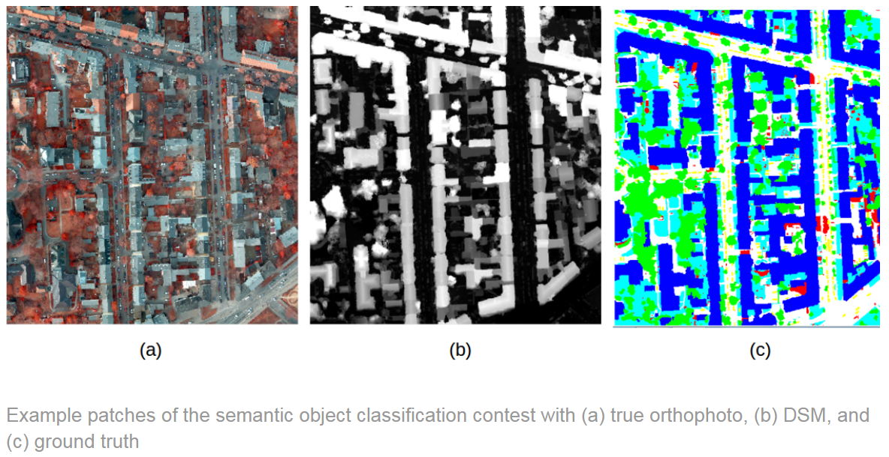

## Rastervision: Trust the Process
1. What is the overall aim of the project and what specific Earth Observation is it trying to solve?
  Rastervision had the following goals: run rastervision quickstart, run rastervision example(s), run rastervision on personal data. Our group and different reasons for using rastervision but ultimately, the goal was to complete semantic segmentation for urban tree canopy and fairy ring fungus in cranberry bogs.  
dgdfgfbgff
2. What were the methods you developed and/or applied?
We developed with the help of Professor Estes and Lewfish how to run rastervision in a p3.2 linux instance (GPU?) on aws using cygwin to ssh into the instance.

The rastervision group had success running the ISPRS Potsdam Semantic Segmentation example from rastervision examples. The input data is below

This example uses three different data layers in order to run the predictions. The data is 5cm aerial imagery which uses RBGIR bands to create a true color composite. The second layer is a normalized DSM using lidar imagery.  Finally, ground truth labels are created by hand for 6 classes: building, tree, low vegetation, impervious, car, and clutter.

3. What were your results? 

  

4. Did the results show that the project aim was realized? Was an Earth Observation limit pushed back (or potentially pushed back)? If this was a group project, how were the results of individual efforts integrated? 
5. What are potential improvements, and any next steps you plan to take? 
